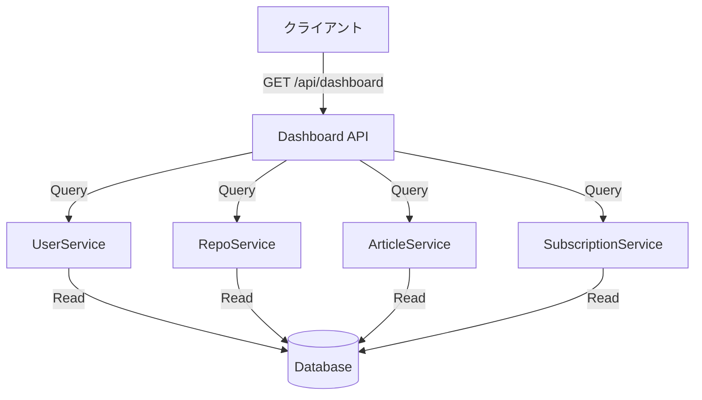
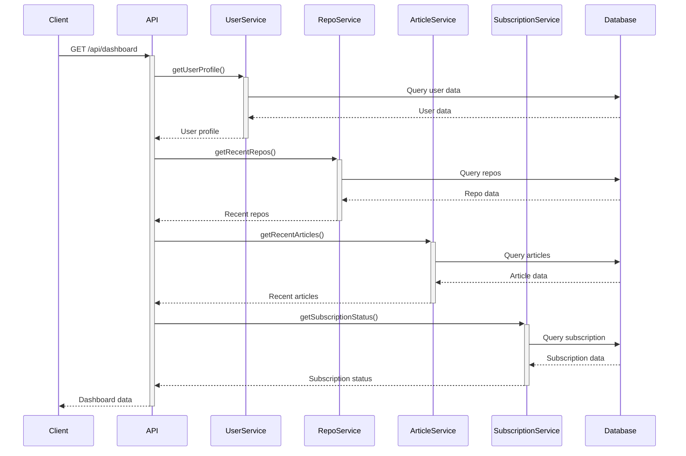

# ダッシュボード API 設計書

## 1. 概要
ユーザーのダッシュボードに必要な情報を一元的に提供するAPIです。

## 2. システム設計

### 2.1 アーキテクチャ図


### 2.2 シーケンス図


## 3. API仕様

### 3.1 エンドポイント
```
GET /api/dashboard
```

### 3.2 認証
- Bearer トークン認証が必要

### 3.3 レスポンス
```typescript
interface DashboardResponse {
  user: {
    id: number;
    username: string;
    email: string;
    avatarUrl: string;
    name: string;
  };
  repositories: {
    total: number;
    recent: Array<{
      id: number;
      name: string;
      description: string;
      url: string;
      stars: number;
      forks: number;
      language: string;
      updatedAt: string;
    }>;
  };
  articles: {
    total: number;
    recent: Array<{
      id: number;
      title: string;
      repoId: number;
      repoName: string;
      createdAt: string;
      updatedAt: string;
      statistics: {
        views: number;
        likes: number;
      };
    }>;
  };
  subscription: {
    plan: string;
    status: string;
    startDate: string;
    endDate: string | null;
  };
  statistics: {
    totalArticleViews: number;
    totalArticleLikes: number;
    totalRepoStars: number;
  };
}
```

### 3.4 エラーレスポンス
```typescript
interface ErrorResponse {
  error: {
    code: string;
    message: string;
  };
}
```

## 4. 実装詳細

### 4.1 必要なサービス
1. UserService
   - ユーザープロフィール情報の取得
2. RepoService
   - リポジトリ情報の取得
   - 最近の更新順でソート
3. ArticleService
   - 記事情報の取得
   - 統計情報の集計
4. SubscriptionService
   - サブスクリプション状態の取得

### 4.2 パフォーマンス最適化
- N+1問題を避けるため、JOINを適切に使用
- 必要なフィールドのみを取得
- キャッシュの活用（Redis等）を検討

### 4.3 セキュリティ考慮事項
- 認証済みユーザーのみアクセス可能
- ユーザーは自身のデータのみ閲覧可能
- センシティブな情報は除外

## 5. テスト計画

### 5.1 ユニットテスト
- 各サービスの個別テスト
- モックを使用してデータベース依存を分離

### 5.2 統合テスト
- エンドポイントの動作確認
- 認証機能の確認
- エラーハンドリングの確認

### 5.3 パフォーマンステスト
- レスポンス時間の測定
- 同時アクセス時の挙動確認
