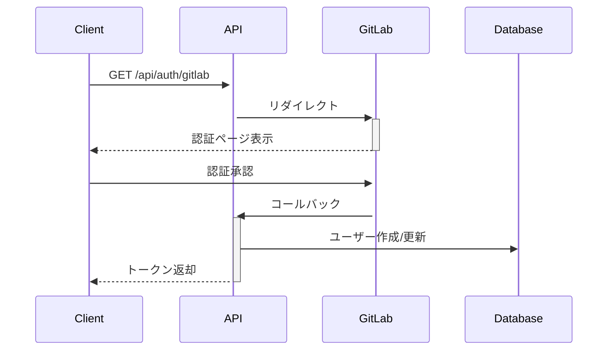
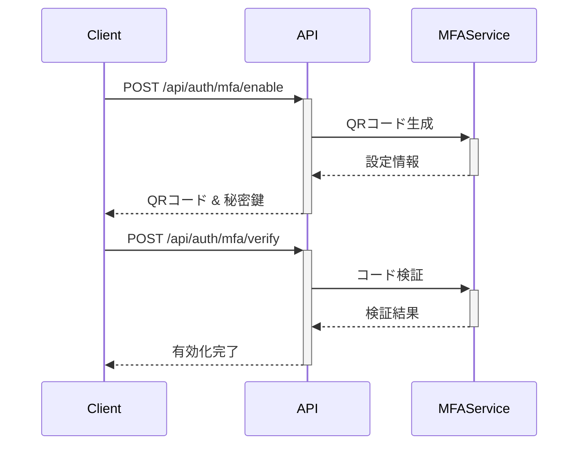
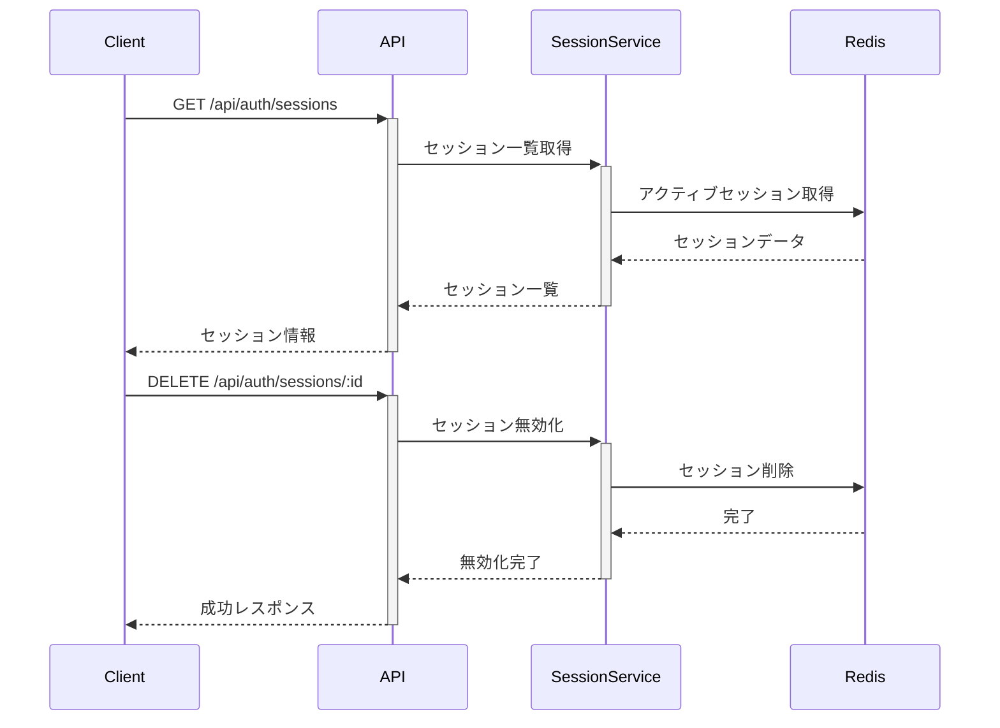
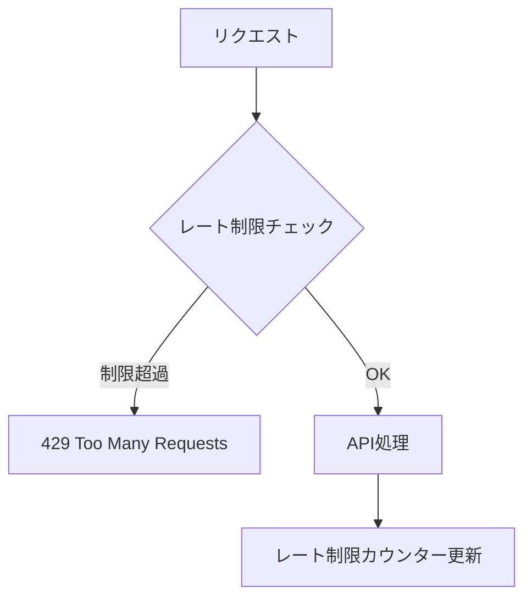

# 認証システム API仕様

## 1. OAuth認証

### 1.1 GitHub認証開始

```http
GET /api/auth/github
```

#### レスポンス
- GitHubの認証ページにリダイレクト

### 1.2 GitHub認証コールバック

```http
GET /api/auth/github/callback
```

#### レスポンス
```json
{
  "accessToken": "string",
  "refreshToken": "string",
  "expiresIn": "number",
  "user": {
    "id": "number",
    "email": "string",
    "username": "string",
    "avatarUrl": "string"
  }
}
```

### 1.3 GitLab認証フロー



## 2. セッション管理

### 2.1 トークンリフレッシュ

```http
POST /api/auth/refresh
```

#### リクエスト
```json
{
  "refreshToken": "string"
}
```

#### レスポンス
```json
{
  "accessToken": "string",
  "refreshToken": "string",
  "expiresIn": "number"
}
```

### 2.2 ログアウト

```http
POST /api/auth/logout
```

#### レスポンス
```json
{
  "message": "Successfully logged out"
}
```

## 3. ユーザー管理

### 3.1 現在のユーザー情報取得

```http
GET /api/auth/me
```

#### レスポンス
```json
{
  "id": "number",
  "email": "string",
  "username": "string",
  "avatarUrl": "string",
  "roles": ["string"],
  "permissions": ["string"]
}
```

### 3.2 MFA設定



## 4. アクセス制御

### 4.1 ロール管理

```http
GET /api/auth/roles
POST /api/auth/roles
PUT /api/auth/roles/:id
DELETE /api/auth/roles/:id
```

### 4.2 パーミッション管理

```http
GET /api/auth/permissions
POST /api/auth/permissions
PUT /api/auth/permissions/:id
DELETE /api/auth/permissions/:id
```

## 5. セキュリティイベント

### 5.1 セッション管理



## 6. エラーレスポンス

### 6.1 認証エラー (401)
```json
{
  "error": {
    "code": "UNAUTHORIZED",
    "message": "Authentication required"
  }
}
```

### 6.2 認可エラー (403)
```json
{
  "error": {
    "code": "FORBIDDEN",
    "message": "Insufficient permissions"
  }
}
```

### 6.3 バリデーションエラー (400)
```json
{
  "error": {
    "code": "VALIDATION_ERROR",
    "message": "Invalid input",
    "details": [
      {
        "field": "string",
        "message": "string"
      }
    ]
  }
}
```

## 7. レート制限

- 基本制限: 60リクエスト/分
- 認証エンドポイント: 10リクエスト/分
- MFA検証: 5リクエスト/分


