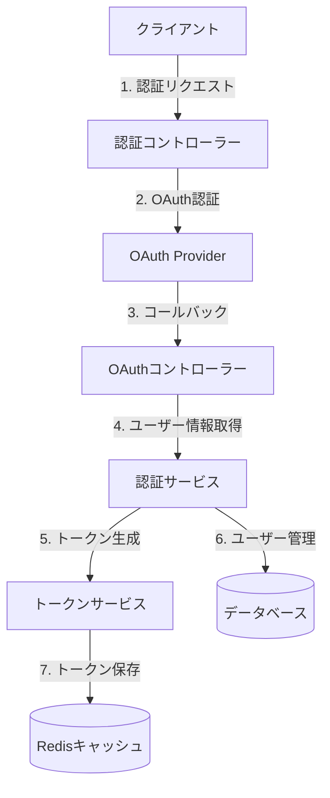
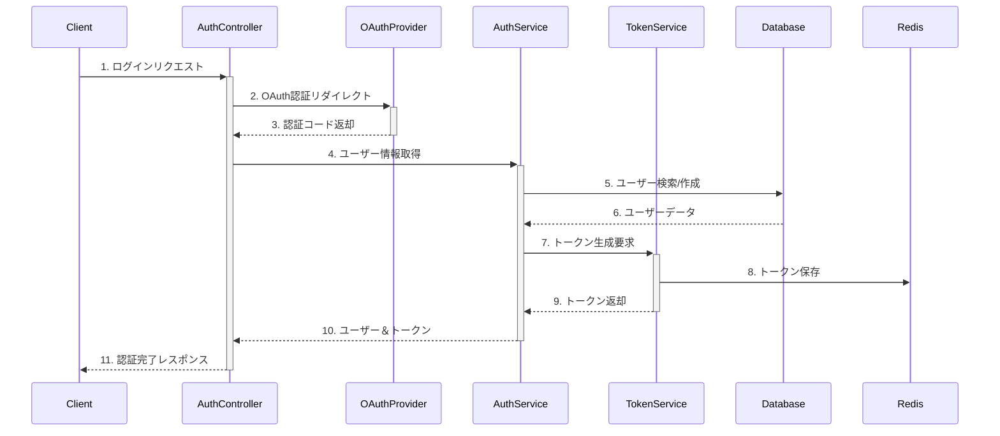
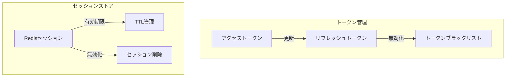
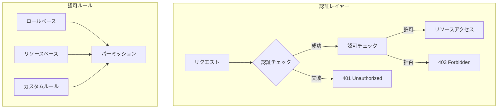
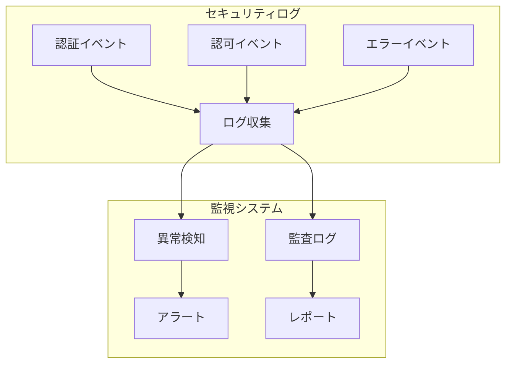
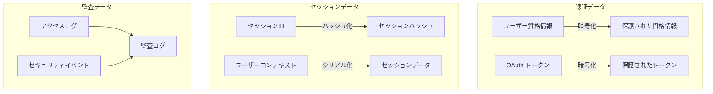

# 認証システム アーキテクチャ設計

## システムアーキテクチャ

```mermaid
graph TD
    Client[クライアント] --> |1. 認証リクエスト| AuthController[認証コントローラー]
    AuthController --> |2. OAuth認証| OAuthProvider[OAuth Provider]
    OAuthProvider --> |3. コールバック| OAuthController[OAuthコントローラー]
    OAuthController --> |4. ユーザー情報取得| AuthService[認証サービス]
    AuthService --> |5. トークン生成| TokenService[トークンサービス]
    AuthService --> |6. ユーザー管理| DB[(データベース)]
    TokenService --> |7. トークン保存| Redis[(Redisキャッシュ)]
```

## 認証フロー

```mermaid
sequenceDiagram
    participant C as Client
    participant AC as AuthController
    participant OP as OAuthProvider
    participant AS as AuthService
    participant TS as TokenService
    participant DB as Database
    participant R as Redis

    C->>+AC: 1. ログインリクエスト
    AC->>+OP: 2. OAuth認証リダイレクト
    OP-->>-AC: 3. 認証コード返却
    AC->>+AS: 4. ユーザー情報取得
    AS->>DB: 5. ユーザー検索/作成
    DB-->>AS: 6. ユーザーデータ
    AS->>+TS: 7. トークン生成要求
    TS->>R: 8. トークン保存
    TS-->>-AS: 9. トークン返却
    AS-->>-AC: 10. ユーザー＆トークン
    AC-->>-C: 11. 認証完了レスポンス
```

## セッション管理

```mermaid
graph TD
    subgraph "トークン管理"
        A[アクセストークン] --> |更新| B[リフレッシュトークン]
        B --> |無効化| C[トークンブラックリスト]
    end

    subgraph "セッションストア"
        D[Redisセッション] --> |有効期限| E[TTL管理]
        D --> |無効化| F[セッション削除]
    end
```

## アクセス制御

```mermaid
graph TD
    subgraph "認証レイヤー"
        A[リクエスト] --> B{認証チェック}
        B --> |成功| C[認可チェック]
        B --> |失敗| D[401 Unauthorized]
        C --> |許可| E[リソースアクセス]
        C --> |拒否| F[403 Forbidden]
    end

    subgraph "認可ルール"
        G[ロールベース] --> J[パーミッション]
        H[リソースベース] --> J
        I[カスタムルール] --> J
    end
```

## セキュリティ監視

```mermaid
graph TD
    subgraph "セキュリティログ"
        A[認証イベント] --> D[ログ収集]
        B[認可イベント] --> D
        C[エラーイベント] --> D
    end

    subgraph "監視システム"
        D --> E[異常検知]
        D --> F[監査ログ]
        E --> G[アラート]
        F --> H[レポート]
    end
```

## データフロー

```mermaid
graph TD
    subgraph "認証データ"
        A[ユーザー資格情報] --> |暗号化| B[保護された資格情報]
        C[OAuth トークン] --> |暗号化| D[保護されたトークン]
    end

    subgraph "セッションデータ"
        E[セッションID] --> |ハッシュ化| F[セッションハッシュ]
        G[ユーザーコンテキスト] --> |シリアル化| H[セッションデータ]
    end

    subgraph "監査データ"
        I[アクセスログ] --> K[監査ログ]
        J[セキュリティイベント] --> K
    end
```
