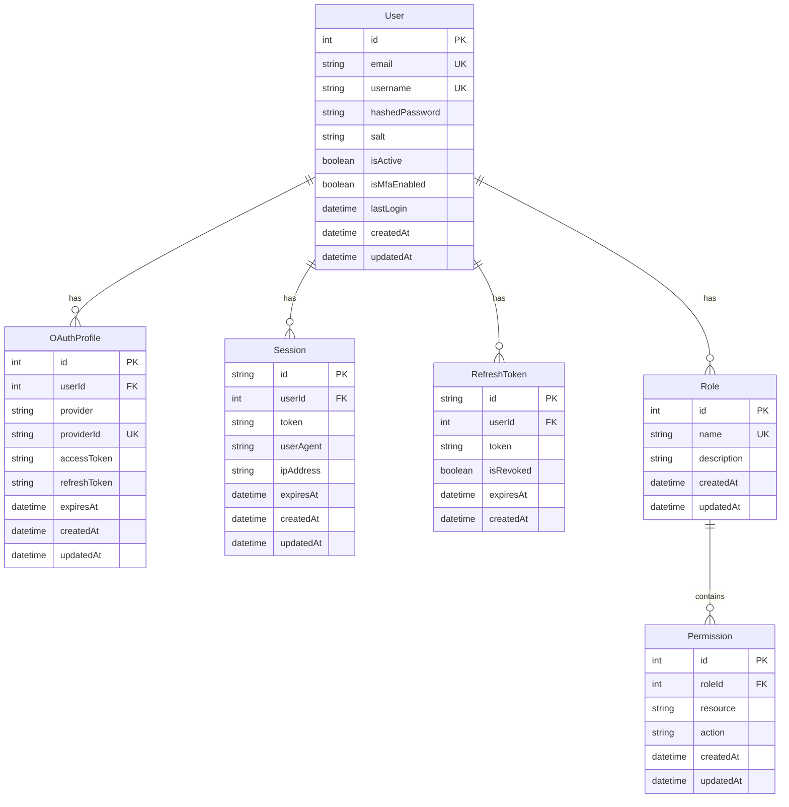
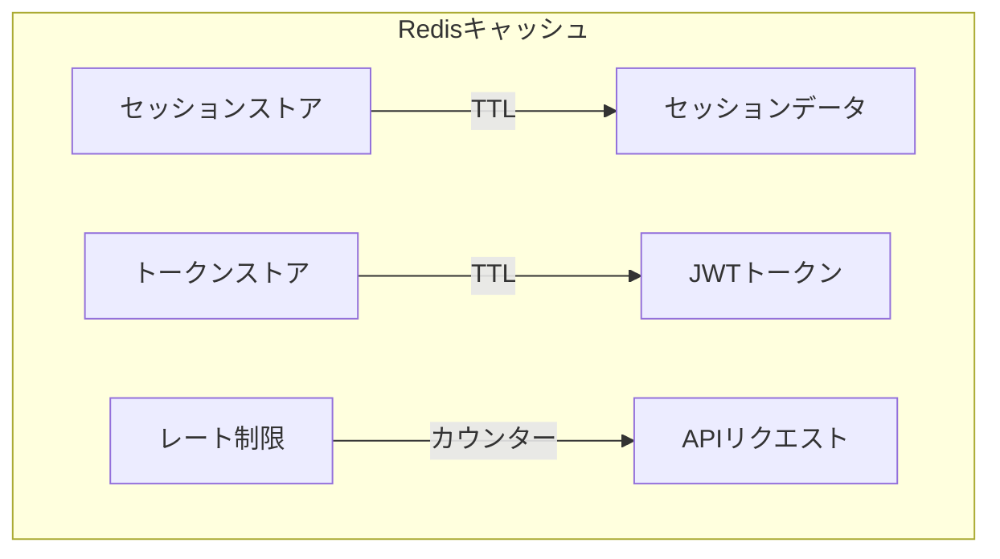
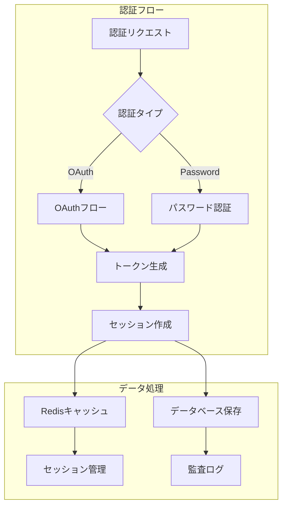

# 認証システム データモデル

## データベースモデル



## キャッシュモデル



## 型定義

### ユーザー関連

```typescript
interface User {
  id: number;
  email: string;
  username: string;
  hashedPassword?: string;
  salt?: string;
  isActive: boolean;
  isMfaEnabled: boolean;
  lastLogin: Date;
  createdAt: Date;
  updatedAt: Date;
  oauthProfiles?: OAuthProfile[];
  roles?: Role[];
}

interface OAuthProfile {
  id: number;
  userId: number;
  provider: 'github' | 'gitlab';
  providerId: string;
  accessToken: string;
  refreshToken?: string;
  expiresAt: Date;
  createdAt: Date;
  updatedAt: Date;
}
```

### 認証関連

```typescript
interface AuthToken {
  accessToken: string;
  refreshToken: string;
  expiresIn: number;
}

interface JWTPayload {
  sub: number;
  email: string;
  username: string;
  roles: string[];
  iat: number;
  exp: number;
}
```

### セッション関連

```typescript
interface Session {
  id: string;
  userId: number;
  token: string;
  userAgent: string;
  ipAddress: string;
  expiresAt: Date;
  createdAt: Date;
  updatedAt: Date;
}

interface SessionData {
  userId: number;
  roles: string[];
  permissions: Permission[];
  lastActivity: Date;
}
```

### アクセス制御

```typescript
interface Role {
  id: number;
  name: string;
  description: string;
  permissions: Permission[];
  createdAt: Date;
  updatedAt: Date;
}

interface Permission {
  id: number;
  roleId: number;
  resource: string;
  action: 'create' | 'read' | 'update' | 'delete';
  createdAt: Date;
  updatedAt: Date;
}
```

## データフロー


