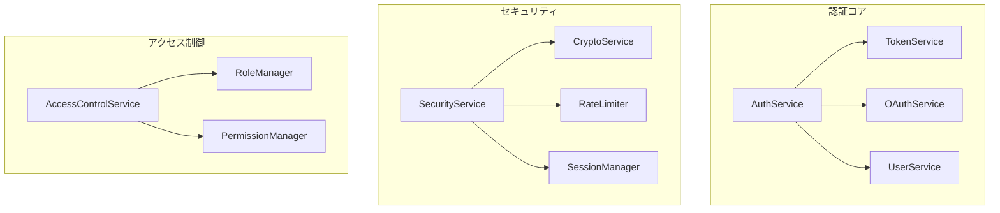
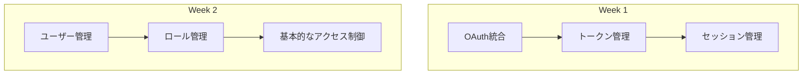
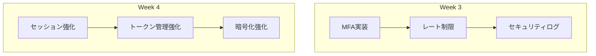
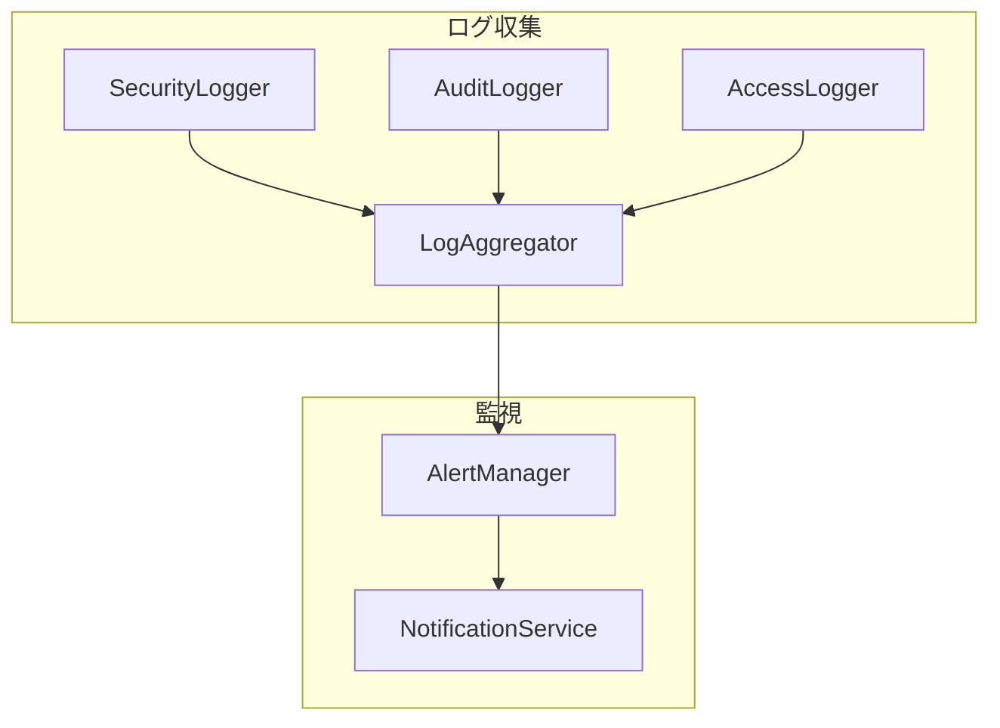
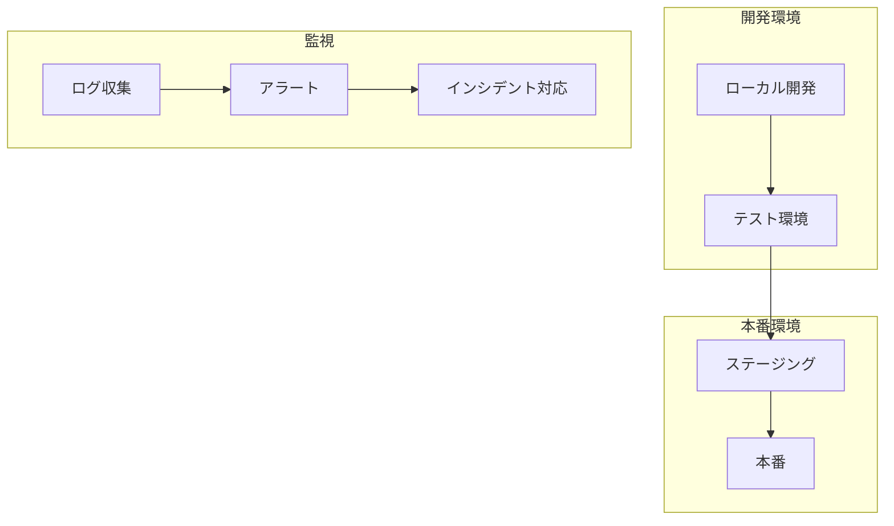

# 認証システム 実装ガイド

## 1. 実装構造

### 1.1 コアコンポーネント



## 2. 実装手順

### 2.1 フェーズ1: 基本認証システム



### 2.2 フェーズ2: セキュリティ強化



## 3. コンポーネント実装

### 3.1 認証サービス

```typescript
interface IAuthService {
  // OAuth認証
  authenticateWithGitHub(code: string): Promise<AuthResult>;
  authenticateWithGitLab(code: string): Promise<AuthResult>;

  // トークン管理
  refreshToken(token: string): Promise<AuthResult>;
  revokeToken(token: string): Promise<void>;

  // セッション管理
  createSession(userId: number): Promise<Session>;
  validateSession(sessionId: string): Promise<boolean>;
  terminateSession(sessionId: string): Promise<void>;

  // MFA
  enableMFA(userId: number): Promise<MFASetup>;
  verifyMFA(userId: number, code: string): Promise<boolean>;
  disableMFA(userId: number): Promise<void>;
}
```

### 3.2 トークンサービス

```typescript
interface ITokenService {
  generateTokens(payload: TokenPayload): Promise<TokenPair>;
  verifyToken(token: string): Promise<TokenPayload>;
  blacklistToken(token: string): Promise<void>;
  isTokenBlacklisted(token: string): Promise<boolean>;
}
```

### 3.3 セッションマネージャー

```typescript
interface ISessionManager {
  create(userId: number, metadata: SessionMetadata): Promise<Session>;
  validate(sessionId: string): Promise<boolean>;
  refresh(sessionId: string): Promise<Session>;
  terminate(sessionId: string): Promise<void>;
  listActiveSessions(userId: number): Promise<Session[]>;
}
```

## 4. セキュリティ実装

### 4.1 暗号化サービス

```typescript
interface ICryptoService {
  hash(data: string, salt?: string): Promise<HashResult>;
  verify(data: string, hash: string): Promise<boolean>;
  encrypt(data: string): Promise<EncryptedData>;
  decrypt(data: EncryptedData): Promise<string>;
}
```

### 4.2 レート制限

```typescript
interface IRateLimiter {
  checkLimit(key: string, limit: number, window: number): Promise<boolean>;
  increment(key: string): Promise<void>;
  reset(key: string): Promise<void>;
}
```

## 5. アクセス制御実装

### 5.1 RBACマネージャー

```typescript
interface IRBACManager {
  assignRole(userId: number, roleId: number): Promise<void>;
  removeRole(userId: number, roleId: number): Promise<void>;
  hasPermission(userId: number, permission: string): Promise<boolean>;
  listUserPermissions(userId: number): Promise<Permission[]>;
}
```

## 6. 監視とログ実装



## 7. テスト実装

### 7.1 ユニットテスト

```typescript
describe('AuthService', () => {
  describe('OAuth Authentication', () => {
    it('should authenticate with GitHub');
    it('should handle GitHub auth failure');
    it('should authenticate with GitLab');
    it('should handle GitLab auth failure');
  });

  describe('Token Management', () => {
    it('should generate valid tokens');
    it('should refresh tokens');
    it('should revoke tokens');
  });

  describe('Session Management', () => {
    it('should create new sessions');
    it('should validate active sessions');
    it('should terminate sessions');
  });
});
```

### 7.2 統合テスト

```typescript
describe('Authentication Flow', () => {
  describe('OAuth Flow', () => {
    it('should complete GitHub auth flow');
    it('should complete GitLab auth flow');
  });

  describe('Session Flow', () => {
    it('should maintain session through requests');
    it('should handle session expiration');
  });

  describe('Access Control', () => {
    it('should enforce role-based access');
    it('should handle permission checks');
  });
});
```

## 8. デプロイメント

### 8.1 環境設定


