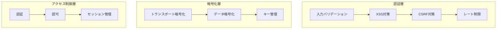
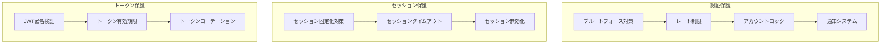
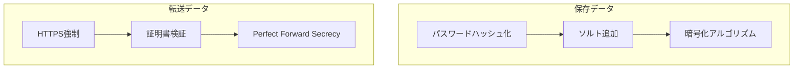
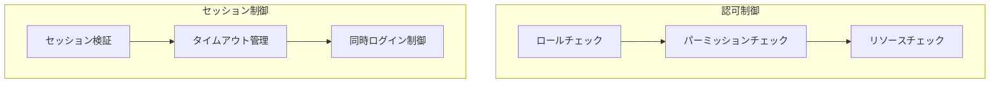
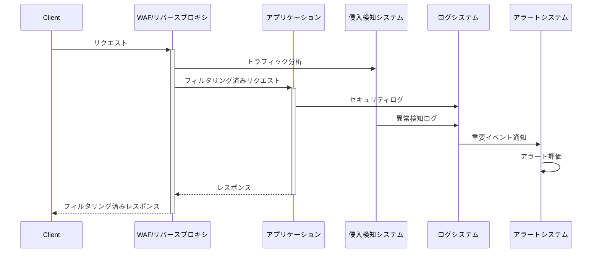

# セキュリティ設計

## セキュリティモデル

## セキュリティ対策

### 1. 認証セキュリティ

### 2. データ保護

### 3. アクセス制御

## セキュリティ監視

## セキュリティチェックリスト

### 認証
- [ ] パスワードポリシーの実装
- [ ] MFAのサポート
- [ ] アカウントロックアウト機能
- [ ] パスワードリセット機能

### セッション管理
- [ ] セキュアなセッションID
- [ ] セッションタイムアウト
- [ ] セッション無効化
- [ ] セッション固定化対策

### アクセス制御
- [ ] 最小権限の原則
- [ ] ロールベースアクセス制御
- [ ] リソースベースアクセス制御
- [ ] APIアクセス制御

### データ保護
- [ ] 機密データの暗号化
- [ ] 安全な鍵管理
- [ ] データバックアップ
- [ ] データ削除ポリシー

### 監視とログ
- [ ] セキュリティログの収集
- [ ] リアルタイム監視
- [ ] インシデント対応計画
- [ ] 定期的なセキュリティ評価
