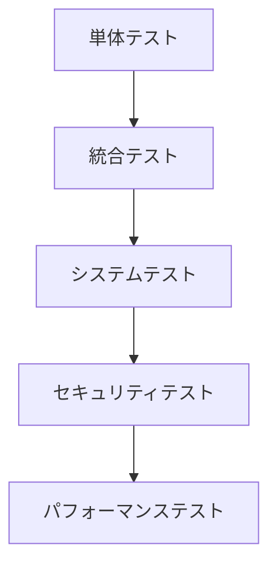
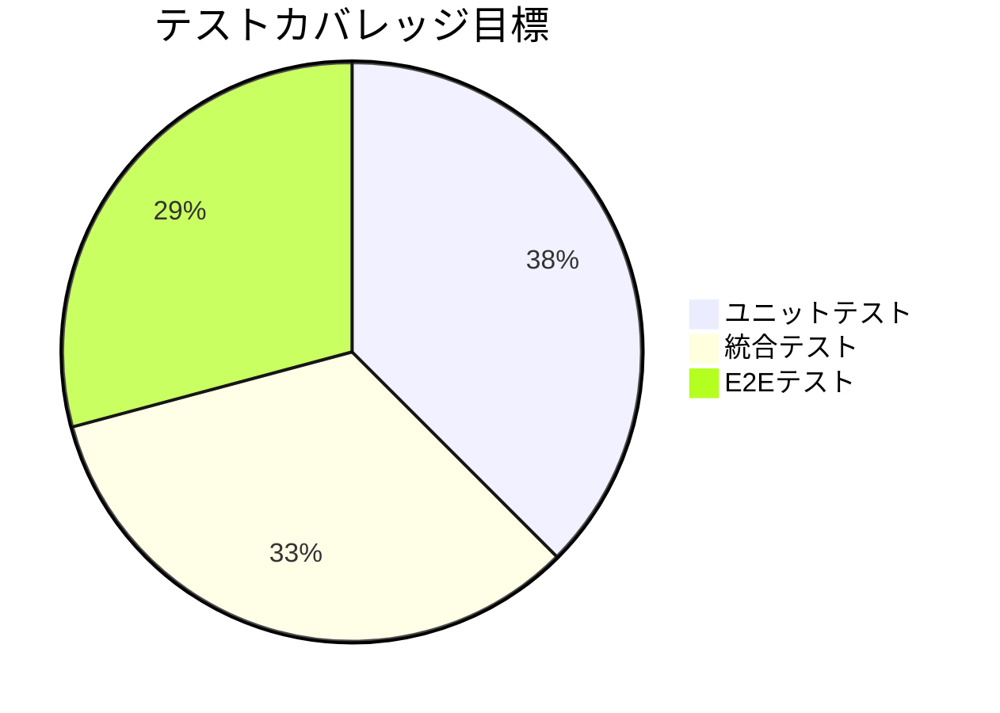
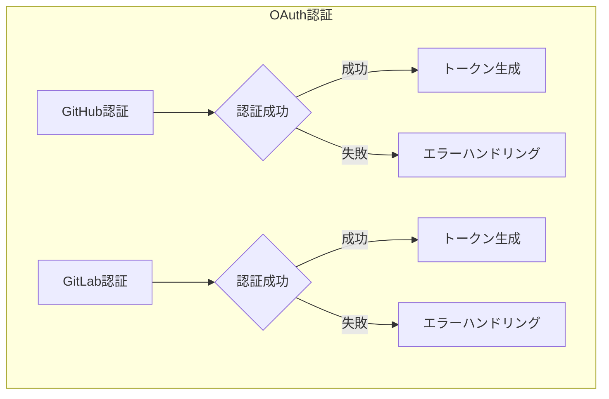
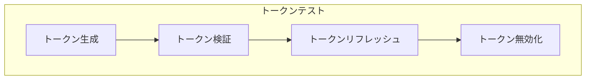
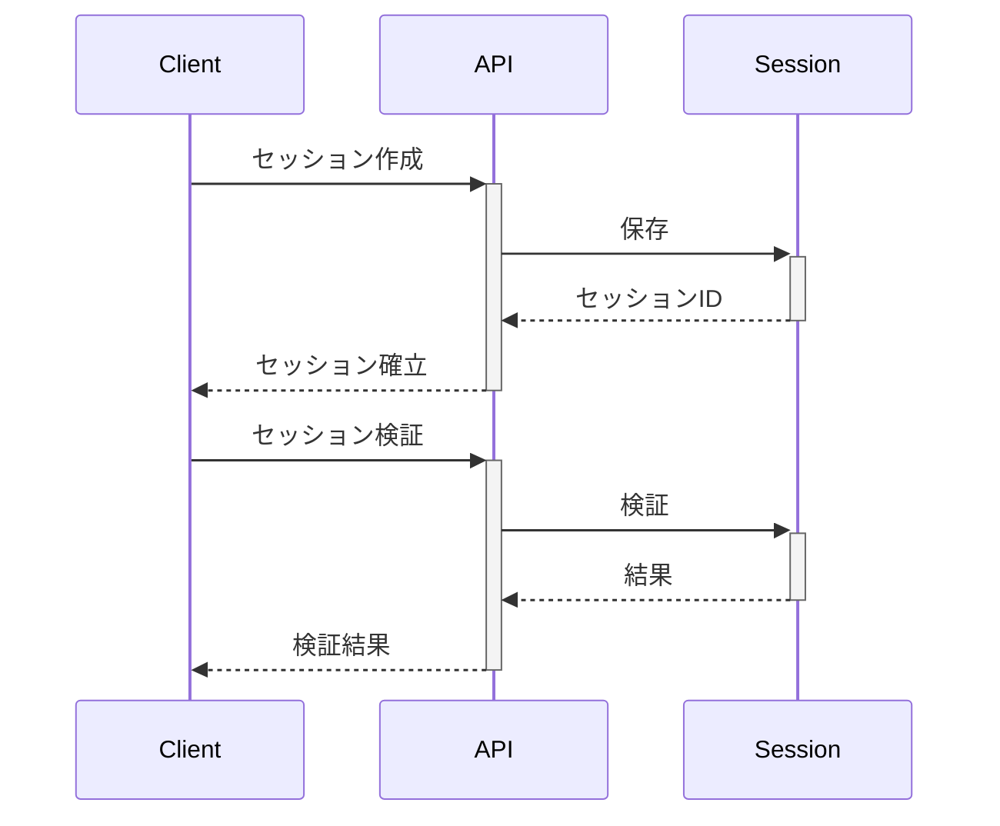
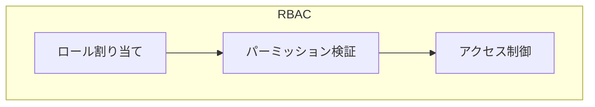
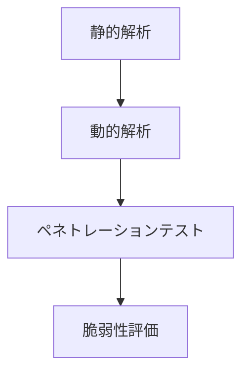
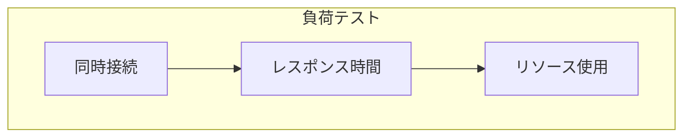
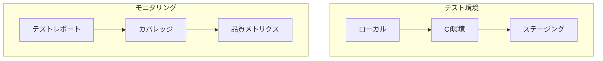
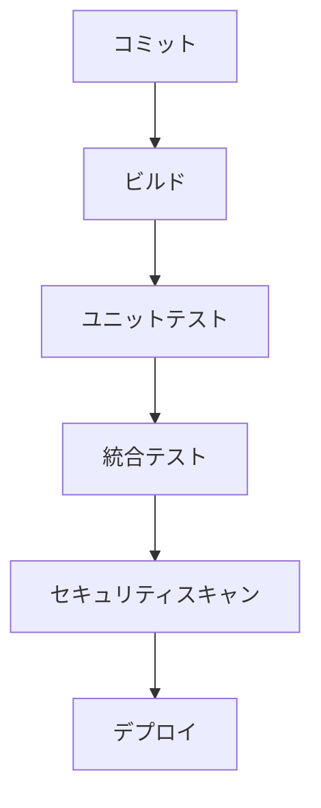

# 認証システム テスト計画

## 1. テスト戦略

### 1.1 テストレベル



### 1.2 テストカバレッジ目標



## 2. テストケース

### 2.1 認証フロー



#### テストケース一覧
1. GitHub認証
   - ✅ 正常な認証フロー
   - ✅ 無効なコード
   - ✅ 期限切れのコード
   - ✅ ネットワークエラー

2. GitLab認証
   - ✅ 正常な認証フロー
   - ✅ 無効なコード
   - ✅ 期限切れのコード
   - ✅ ネットワークエラー

### 2.2 トークン管理



#### テストケース一覧
1. アクセストークン
   - ✅ 正常な生成
   - ✅ 有効期限の検証
   - ✅ 署名の検証
   - ✅ ペイロードの検証

2. リフレッシュトークン
   - ✅ 正常なリフレッシュ
   - ✅ 無効なトークン
   - ✅ 期限切れトークン
   - ✅ 再利用の防止

### 2.3 セッション管理



#### テストケース一覧
1. セッション作成
   - ✅ 新規セッション
   - ✅ 重複セッション
   - ✅ 無効なユーザー

2. セッション検証
   - ✅ 有効なセッション
   - ✅ 期限切れセッション
   - ✅ 無効化されたセッション

### 2.4 アクセス制御



#### テストケース一覧
1. ロール管理
   - ✅ ロール作成
   - ✅ ロール更新
   - ✅ ロール削除
   - ✅ ロール割り当て

2. パーミッション
   - ✅ パーミッション追加
   - ✅ パーミッション検証
   - ✅ パーミッション削除

## 3. セキュリティテスト

### 3.1 脆弱性スキャン



#### テスト項目
- SQLインジェクション
- XSS攻撃
- CSRF攻撃
- パスワード強度
- セッションハイジャック
- レート制限バイパス

### 3.2 パフォーマンステスト



#### テスト指標
- 同時接続数: 1000
- レスポンス時間: < 200ms
- エラー率: < 0.1%
- CPU使用率: < 70%
- メモリ使用率: < 80%

## 4. テスト環境

### 4.1 環境構成



### 4.2 テストデータ

```typescript
// ユーザーテストデータ
const testUsers = [
  {
    id: 1,
    email: "test@example.com",
    roles: ["user"],
    permissions: ["read:profile"]
  },
  {
    id: 2,
    email: "admin@example.com",
    roles: ["admin"],
    permissions: ["*"]
  }
];

// トークンテストデータ
const testTokens = {
  valid: "eyJhbGciOiJIUzI1NiIs...",
  expired: "eyJhbGciOiJIUzI1NiIs...",
  invalid: "invalid-token"
};
```

## 5. CI/CD統合

### 5.1 テスト自動化



### 5.2 品質ゲート

- ユニットテストカバレッジ: 90%以上
- 統合テストカバレッジ: 80%以上
- セキュリティ警告: 0
- コードスメル: 重大度High 0件
- テスト成功率: 100%
