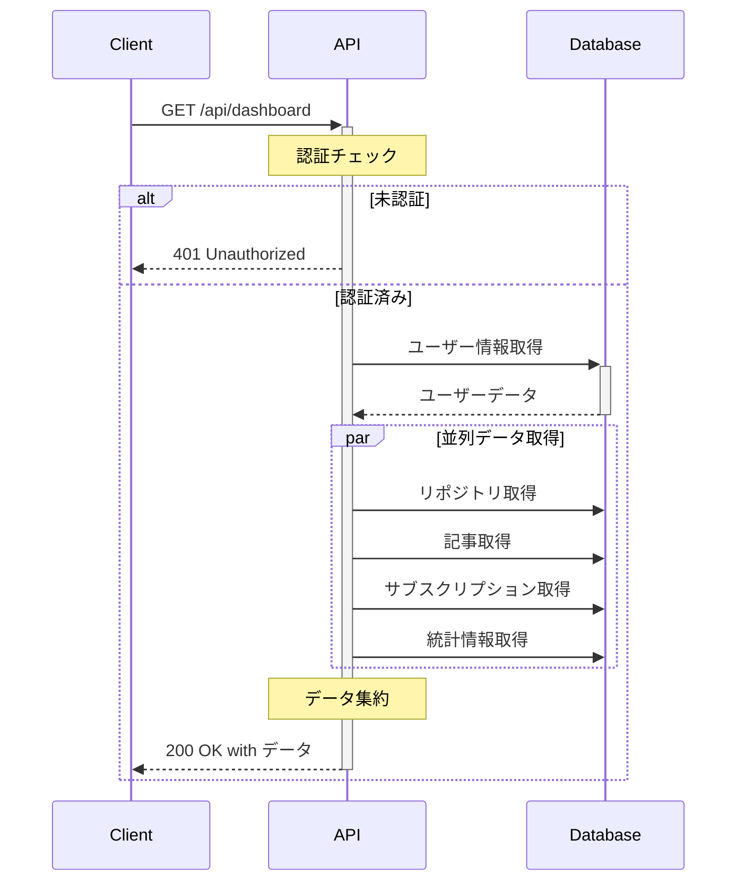

# ダッシュボード API設計書

## 1. API概要
ユーザーのダッシュボードに必要な情報を一元的に提供するAPIです。

## 2. エンドポイント

### GET /api/dashboard

#### 認証
- Bearer トークン認証が必要
- ヘッダー: `Authorization: Bearer <token>`

#### リクエスト
- パラメータ: なし

#### レスポンス

##### 成功時 (200 OK)
```json
{
  "user": {
    "id": number,
    "username": string,
    "email": string,
    "avatarUrl": string | null,
    "name": string | null
  },
  "repositories": {
    "total": number,
    "recent": [
      {
        "id": number,
        "name": string,
        "description": string | null,
        "url": string,
        "stars": number,
        "forks": number,
        "language": string | null,
        "updatedAt": string
      }
    ]
  },
  "articles": {
    "total": number,
    "recent": [
      {
        "id": number,
        "title": string,
        "repoId": number,
        "repoName": string,
        "createdAt": string,
        "updatedAt": string,
        "statistics": {
          "views": number,
          "likes": number
        }
      }
    ]
  },
  "subscription": {
    "plan": string,
    "status": string,
    "startDate": string,
    "endDate": string | null
  },
  "statistics": {
    "totalArticleViews": number,
    "totalArticleLikes": number,
    "totalRepoStars": number
  }
}
```

##### エラー時

###### 401 Unauthorized
```json
{
  "error": {
    "code": "UNAUTHORIZED",
    "message": "Authentication required"
  }
}
```

###### 500 Internal Server Error
```json
{
  "error": {
    "code": "INTERNAL_SERVER_ERROR",
    "message": "An unexpected error occurred"
  }
}
```

## 3. データフロー



## 4. セキュリティ

### 認証・認可
- JWTトークンによる認証
- ユーザーは自身のデータのみアクセス可能

### データ保護
- センシティブな情報は除外
- HTTPS通信のみ許可

### レート制限
- 1分間に60リクエストまで

## 5. パフォーマンス

### キャッシュ戦略
- レスポンスキャッシュ: 5分
- ユーザー情報: 1時間
- 統計情報: 1時間

### 最適化
- 必要なフィールドのみ取得
- データベースクエリの最適化
- 並列データ取得

## 6. エラーハンドリング

### エラーコード
- `UNAUTHORIZED`: 認証エラー
- `INTERNAL_SERVER_ERROR`: サーバーエラー

### ログ記録
- エラー発生時のコンテキスト記録
- スタックトレースの記録（開発環境のみ）

## 7. 監視

### メトリクス
- レスポンス時間
- エラー率
- リクエスト数

### アラート
- エラー率5%超過
- レスポンス時間1秒超過
- 5xx エラー発生
