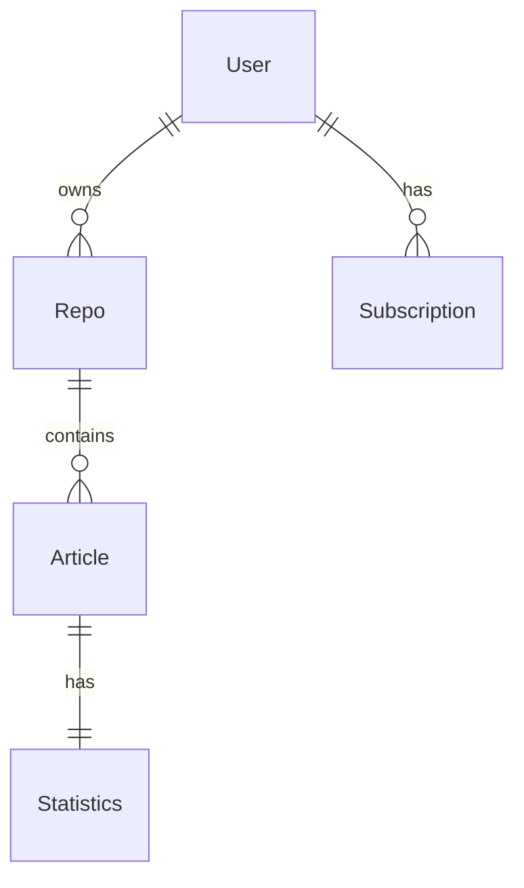
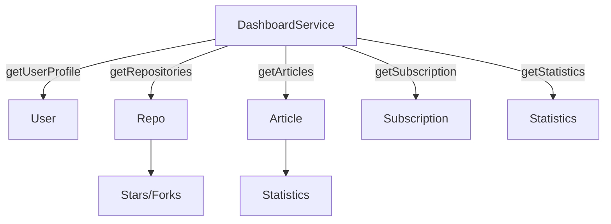

# ダッシュボード データモデル

## 型定義

### DashboardResponse
ダッシュボードAPIのレスポンス全体の構造を定義します。

```typescript
interface DashboardResponse {
  user: DashboardUserProfile;
  repositories: {
    total: number;
    recent: DashboardRepository[];
  };
  articles: {
    total: number;
    recent: DashboardArticle[];
  };
  subscription: DashboardSubscription;
  statistics: DashboardStatistics;
}
```

### DashboardUserProfile
ユーザープロフィール情報の構造を定義します。

```typescript
interface DashboardUserProfile {
  id: number;
  username: string;
  email: string;
  avatarUrl: string | null;
  name: string | null;
}
```

### DashboardRepository
リポジトリ情報の構造を定義します。

```typescript
interface DashboardRepository {
  id: number;
  name: string;
  description: string | null;
  url: string;
  stars: number;
  forks: number;
  language: string | null;
  updatedAt: Date;
}
```

### DashboardArticle
記事情報の構造を定義します。

```typescript
interface DashboardArticle {
  id: number;
  title: string;
  repoId: number;
  repoName: string;
  createdAt: Date;
  updatedAt: Date;
  statistics: {
    views: number;
    likes: number;
  };
}
```

### DashboardSubscription
サブスクリプション情報の構造を定義します。

```typescript
interface DashboardSubscription {
  plan: string;
  status: string;
  startDate: Date;
  endDate: Date | null;
}
```

### DashboardStatistics
統計情報の構造を定義します。

```typescript
interface DashboardStatistics {
  totalArticleViews: number;
  totalArticleLikes: number;
  totalRepoStars: number;
}
```

## データベースリレーション



## データの取得フロー


