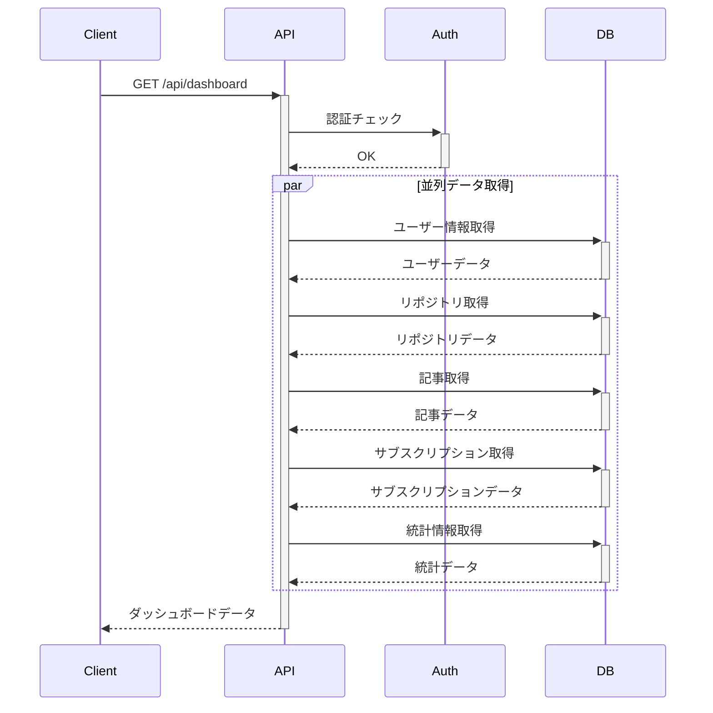

# ダッシュボード 実装詳細

## ディレクトリ構造

```
src/
├── controllers/
│   └── dashboard.controller.ts  # ダッシュボードコントローラー
├── services/
│   └── dashboard.service.ts     # ダッシュボードサービス
├── routes/
│   └── dashboard.routes.ts      # ルーティング定義
└── types/
    └── dashboard.ts            # 型定義
```

## コンポーネント詳細

### 1. DashboardController
- 役割: HTTPリクエストの処理とレスポンスの生成
- 主な機能:
  - リクエストの認証確認
  - サービスの呼び出し
  - エラーハンドリング
- エラー処理:
  - 401: 未認証エラー
  - 500: 内部サーバーエラー

### 2. DashboardService
- 役割: ビジネスロジックとデータ取得の実装
- 主な機能:
  - ユーザープロフィールの取得
  - リポジトリ情報の取得
  - 記事情報の取得
  - サブスクリプション情報の取得
  - 統計情報の集計
- 最適化:
  - Promise.allによる並列データ取得
  - 必要なフィールドのみを選択的に取得

### 3. ルーティング
- エンドポイント: `GET /api/dashboard`
- ミドルウェア:
  - 認証チェック（authenticateToken）
- アクセス制御:
  - 認証済みユーザーのみアクセス可能

## データ取得フロー



## パフォーマンス最適化

1. データベースクエリの最適化
   - 必要なフィールドのみを選択
   - 適切なインデックスの使用
   - N+1問題の回避

2. 並列処理
   - Promise.allによる同時データ取得
   - 独立したデータの並列取得

3. データ制限
   - 最近のリポジトリは5件まで
   - 最近の記事は5件まで

## セキュリティ対策

1. 認証
   - JWTトークンによる認証
   - 有効期限の確認

2. アクセス制御
   - ユーザーは自身のデータのみアクセス可能
   - センシティブな情報の除外

3. エラーハンドリング
   - スタックトレースの非表示
   - 適切なエラーメッセージの提供
