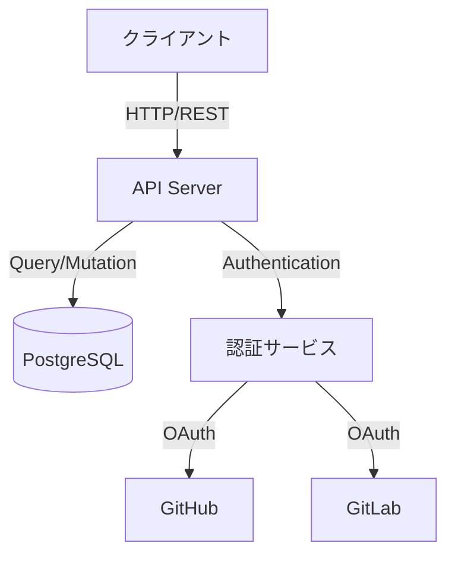
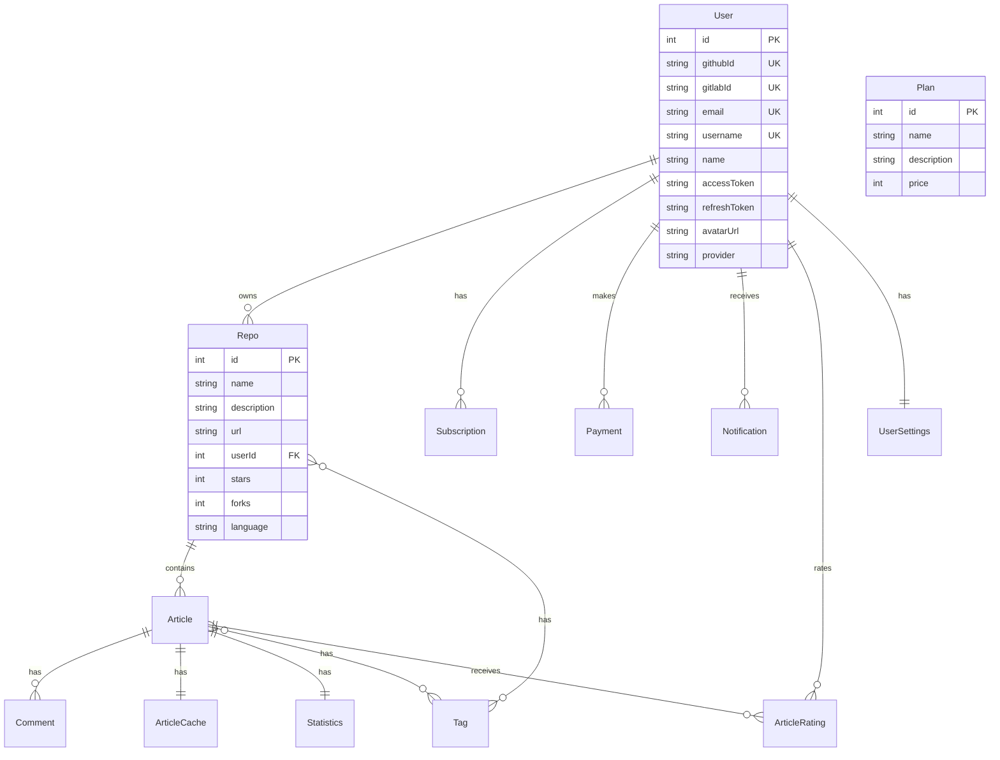
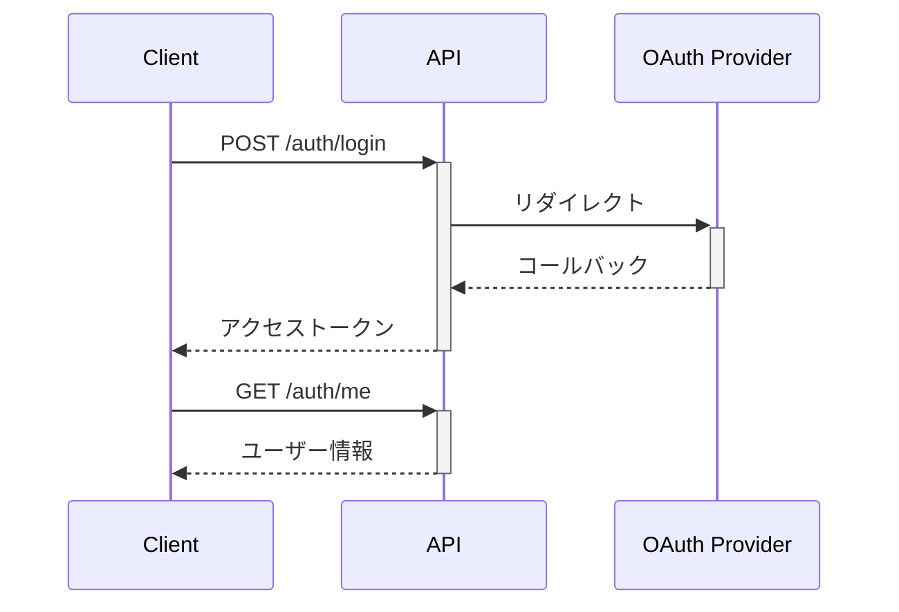
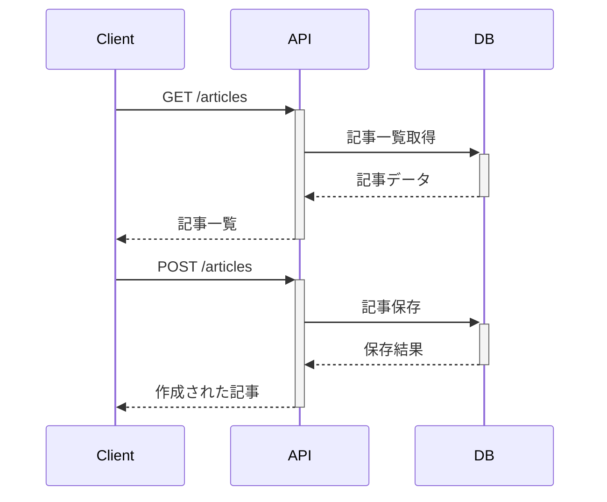

# RepoRiot プロジェクト構造ドキュメント

## 目次
1. [プロジェクト概要](#プロジェクト概要)
2. [システムアーキテクチャ](#システムアーキテクチャ)
3. [データベース設計](#データベース設計)
4. [APIエンドポイント](#apiエンドポイント)
5. [ディレクトリ構造](#ディレクトリ構造)

## プロジェクト概要
RepoRiotは、GitHubやGitLabのリポジトリに関する記事を管理・共有するプラットフォームです。

## システムアーキテクチャ



## データベース設計



## APIエンドポイント

### 認証関連


### 記事関連


## ディレクトリ構造

```
backend-repo/
├── src/
│   ├── config/        # 設定ファイル
│   ├── controllers/   # APIコントローラー
│   ├── middleware/    # ミドルウェア
│   ├── models/        # データモデル
│   ├── routes/        # ルーティング
│   ├── services/      # ビジネスロジック
│   ├── types/         # 型定義
│   └── utils/         # ユーティリティ
├── prisma/
│   └── schema.prisma  # データベーススキーマ
├── docs/             # ドキュメント
└── public/           # 静的ファイル
```

各ディレクトリの役割：

- `src/config`: アプリケーションの設定ファイルを管理
- `src/controllers`: HTTPリクエストの処理とレスポンスの生成
- `src/middleware`: 認証やログなどの共通処理
- `src/models`: データモデルの定義
- `src/routes`: APIエンドポイントのルーティング
- `src/services`: ビジネスロジックの実装
- `src/types`: TypeScript型定義
- `src/utils`: 共通ユーティリティ関数
